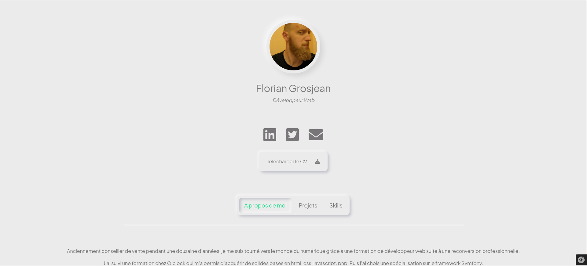
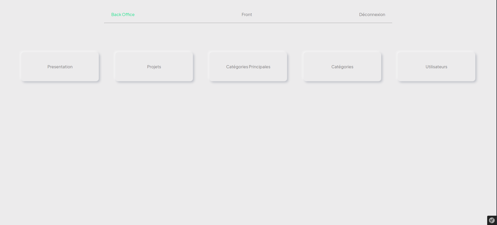

# Portfolio-Symfony

Création d'un portfolio pour me présenter.

Développé avec Symfony en 5.4, avec CSS personnalisé et JavaScript pour l'animation d'accueil et sélection du menu.

Pages 404 et 403 personnalisées.

Backoffice pour modifier ou ajouter des informations.

Tests
